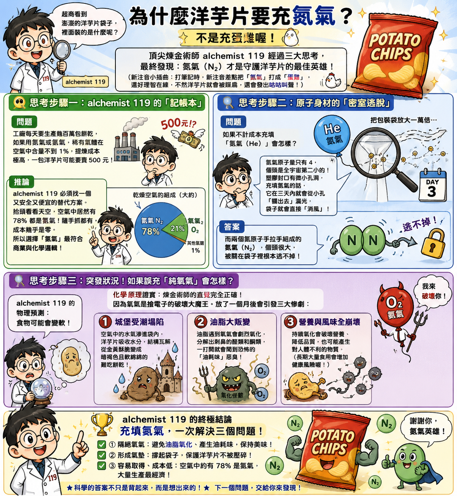
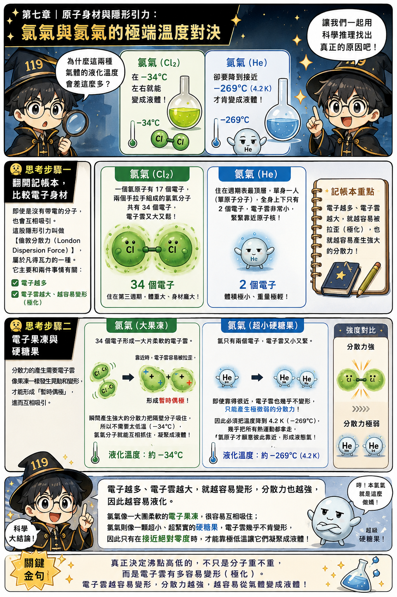
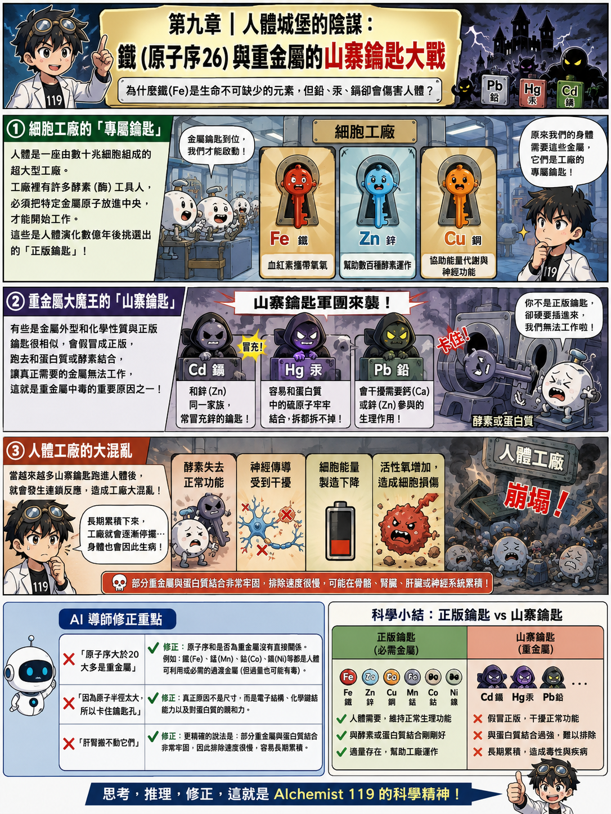
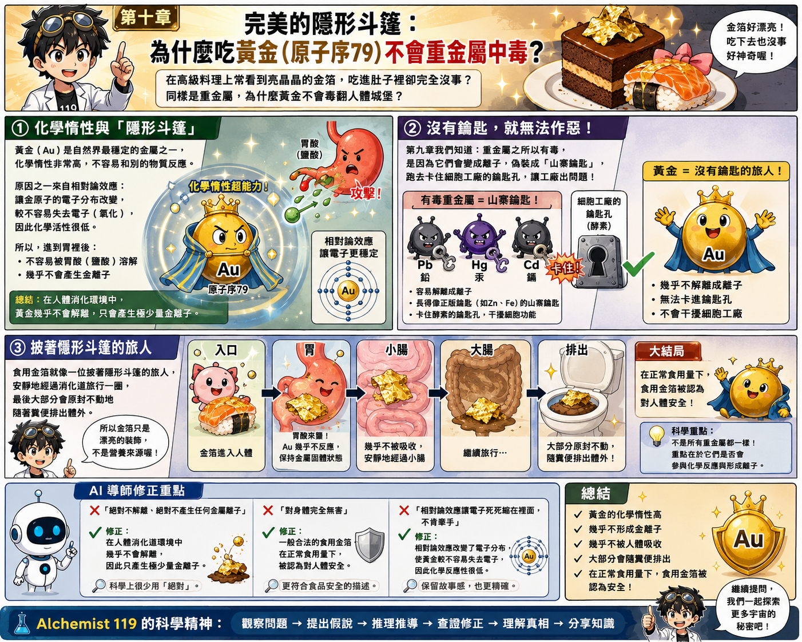
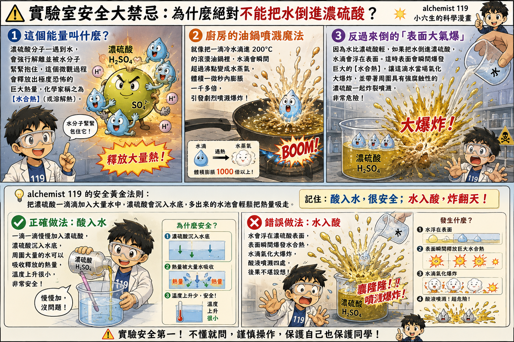
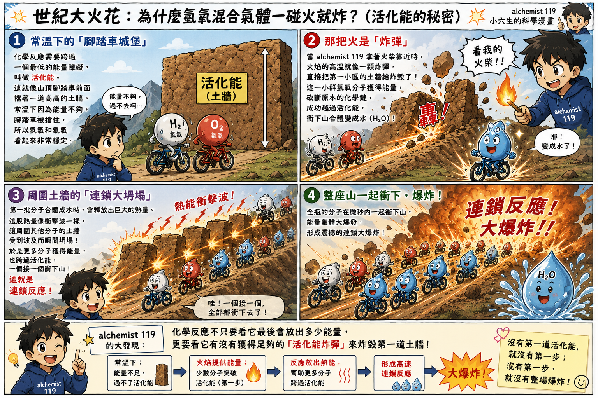
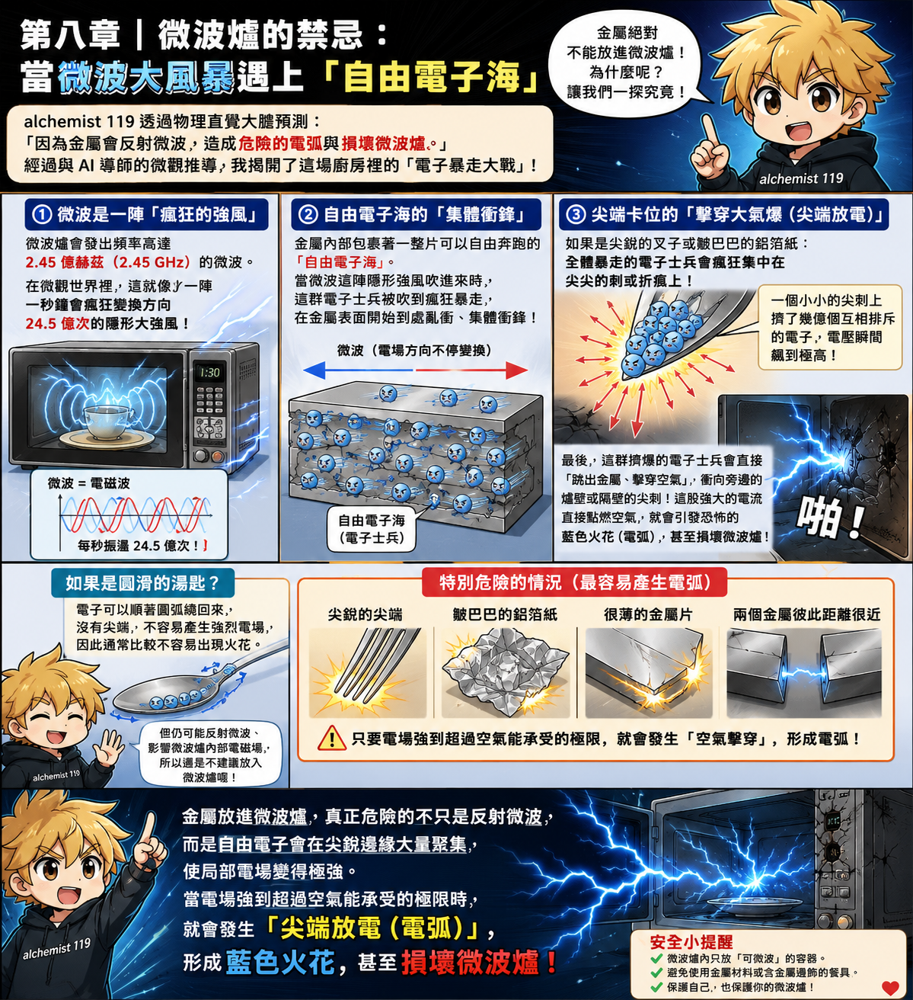
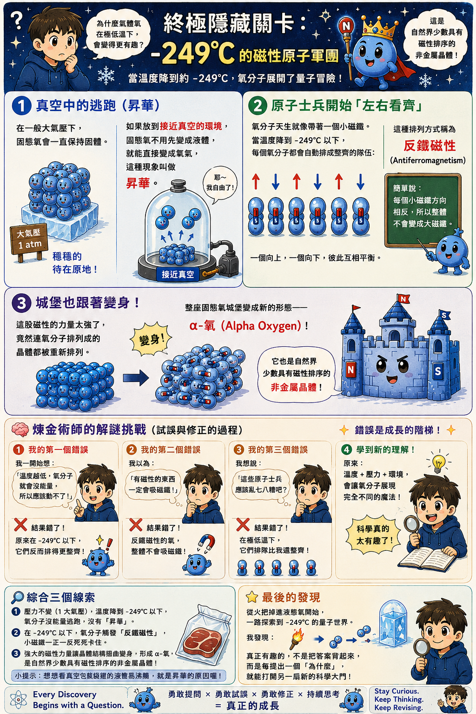
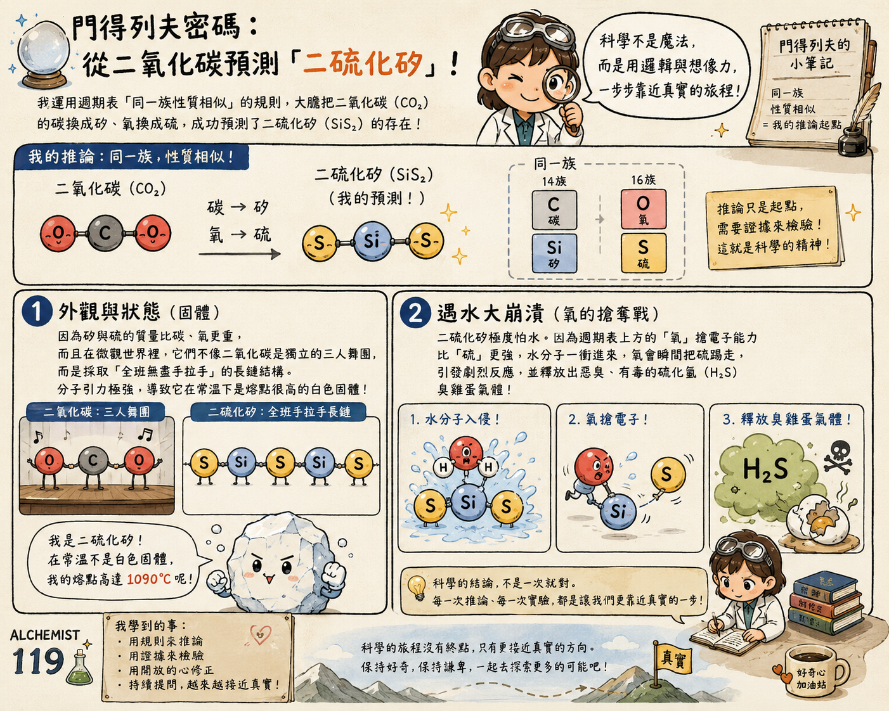
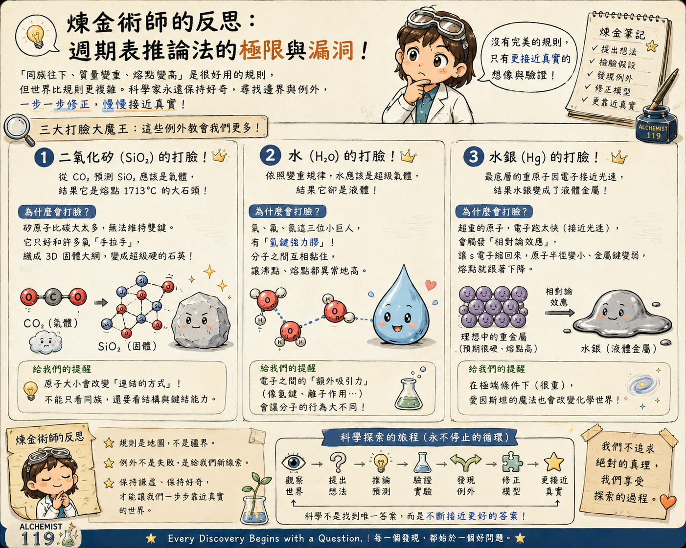

<div align="center">

# 🧪 Alchemist 119

### 🔬 Science × 🤖 AI × 💭 Thinking × 🎨 Comics

# 用科學，學會思考。

> **Every Discovery Begins with a Question.**

一位小六學生，
用漫畫記錄自己的思考旅程。

🌱 **Curious** ｜ 🤝 **Humble** ｜ 🔄 **Flexible**

</div>

---

# 👋 關於我

大家好，我是 **Alchemist 119**。

我喜歡提問。

也喜歡用科學思考。

每一篇漫畫，

都記錄著一次新的發現。

---

# 🌱 Learning Through Thinking

```text
❓ 提出問題
      ↓
💭 建立假說
      ↓
🧠 自己推理
      ↓
🤖 AI 一起討論
      ↓
📚 尋找證據
      ↓
🔄 修正想法
      ↓
🎨 分享漫畫
```

> **AI 不替我思考。**
>
> **AI 陪我提出更好的問題。**

---

# 📚 Comic Collection

---

# 🟡 第一章｜從生活開始

> 從生活出發。

### 為什麼建立 GitHub？


---

### 我和 AI 一起思考


---

### 思考日誌


---

### 燙頭髮的化學


---

### 洋芋片為什麼充氮氣？



---

# 🔵 第二章｜探索微觀世界

> 看見看不見的世界。

### 黃金 vs 鐵


---

### 氯氣 vs 氦氣



---

### 鐵與重金屬



---

### 吃黃金為什麼沒事？



---

### Xe 為什麼能形成 XePtF₆？


---

### XePtF₆ 為什麼遇水會分解？


---

# 🔴 第三章｜理解化學反應

> 理解能量變化。

### 濃硫酸與水



---

### 氫氧爆炸



---

### 微波爐與金屬



---

# ❄️ 第四章｜探索極端世界

> 挑戰極端條件。

### Episode 1


---

### Episode 2


---

### Episode 3


---

### Episode 4


---

### Episode 5


---

### Episode 6


---

### Episode 7



---

# 🌿 第五章｜永續與生活

> 科學走進生活。

### 纖維素酒精


---

### 為什麼不用強酸？


---

# 🧠 第六章｜Thinking Lab

> 修正思考模型。

### 從 CO₂ 推測 SiS₂



---

### 模型的邊界



---

# ❤️ 我想分享的

保持好奇。

保持謙遜。

保持彈性。

每一次修正，

都是新的發現。

---

<div align="center">

## Learn Through Thinking.

🌱 Keep Curious.

🤝 Stay Humble.

🔄 Stay Flexible.

---

**Every Discovery Begins with a Question.**

</div>
